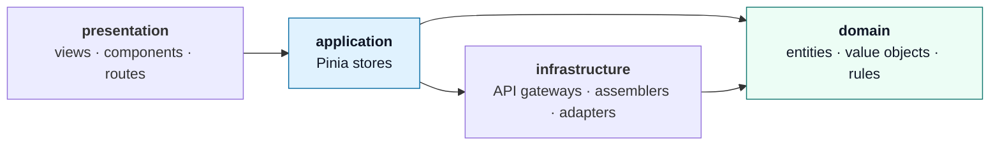
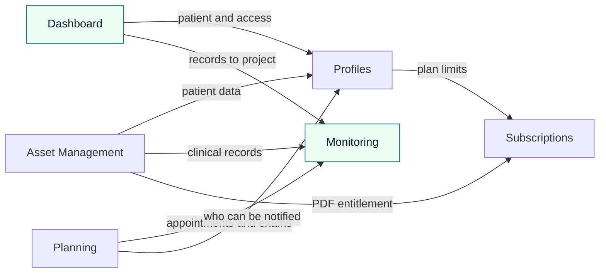

<div align="center">


**Connected care for older adults.**
One shared place where caregivers record the daily care and families stay informed.

[](https://vuejs.org/)
[](https://vite.dev/)
[](https://primevue.org/)
[](https://nodejs.org/)
[](https://www.conventionalcommits.org/)
[](LICENSE)

[About](#about) ·
[Features](#features) ·
[Tech stack](#tech-stack) ·
[Architecture](#architecture) ·
[Getting started](#getting-started) ·
[Contributing](#git-workflow) ·
[Team](#team)

</div>

---

## About

Caring for an older adult generates a constant flow of information: vital signs, medication, appointments, exam results, observations. In practice, that information ends up scattered across paper notebooks, phone photos and WhatsApp chats, and it is hard to find when someone needs it, especially in an emergency.

**Vitalita** centralizes it in a single web application:

- **Caregivers and nurses** record the daily follow-up in a structured way.
- **Authorized family members** follow the same information in read-only mode, without depending on calls or messages.
- Both can open, and on paid plans export, an **emergency summary** to hand over at a clinic or hospital.

This repository contains the **web application** (frontend) of Vitalita, developed by the startup **Mobvite** for the course *Aplicaciones Web (1ASI0730)* at Universidad Peruana de Ciencias Aplicadas (UPC).

> **Project status.** The web application is complete and runs against a fake REST API built with `json-server`. The RESTful API in C# / ASP.NET Core is the next sprint; switching to it is mostly a configuration change (see [Architecture](#architecture)).

## Features

### For caregivers and nurses

| Area | What you can do |
|---|---|
| **Older adults** | Register and edit patients (ID, blood type, allergies, chronic conditions, emergency contact) and switch between them when the plan allows more than one |
| **Daily follow-up** | Record vital signs with format validation, write a daily report with mood and condition, and keep categorized patient notes in a timeline |
| **Medication** | Manage the medication schedule and register each dose, with protection against registering the same dose twice |
| **Clinical records** | Register exams and their results, attach photo or PDF evidence, and record the outcome of medical appointments |
| **Planning** | Care calendar with appointments, therapies and reminders. Reminders are created automatically for upcoming appointments and pending exams, and can also be created manually |
| **Family access** | Invite relatives with a code, a link or WhatsApp, and revoke access at any time |
| **Emergency summary** | Allergies, current medication, latest vital signs and recent exams in one screen, with PDF export on Pro and Agency plans |
| **Subscription** | Choose a plan, pay with card or Yape, and follow plan status, usage and payment history |

### For family members

| Area | What you can do |
|---|---|
| **Sign up** | Create an account from the caregiver's invitation code |
| **Home** | See how the older adult is today: condition, mood, latest vital signs, doses given and upcoming appointments |
| **History** | Browse every record in chronological order and filter by type, date range and keyword |
| **Notifications** | Get notified when the caregiver registers a daily report, an exam result or an appointment |
| **Emergency summary** | Open the information needed at a clinic, plus the professional profile of the caregiver in charge |

Family members have **read-only access**. Only people with an active invitation receive information or notifications.

### Across the application

- **Bilingual interface.** English (default) and Spanish, switchable at any time and remembered between visits.
- **Responsive design.** The layout adapts from mobile to desktop, including a slide-in menu on small screens.
- **Accessibility.** Skip link, visible focus, keyboard-operable controls, ARIA labels and live regions for dynamic content, text alternatives for charts and images, and support for reduced motion.
- **Role-based access.** Route guards show each role only what it can use.

## Tech stack

| Layer | Technology | Purpose |
|---|---|---|
| **Framework** | [Vue 3](https://vuejs.org/) (Composition API) | Reactive UI |
| **Build tool** | [Vite 8](https://vite.dev/) | Dev server and bundling |
| **State** | [Pinia 4](https://pinia.vuejs.org/) | Application layer stores |
| **Routing** | [Vue Router 5](https://router.vuejs.org/) | Navigation and guards |
| **UI components** | [PrimeVue 5](https://primevue.org/) + [@primeuix/themes](https://primevue.org/theming/styled/) | Components, with the Material preset customized to the brand palette |
| **Layout and icons** | [PrimeFlex 4](https://primeflex.org/), [PrimeIcons 8](https://primevue.org/icons/) | Utility classes and icon set |
| **Internationalization** | [vue-i18n 11](https://vue-i18n.intlify.dev/) | English and Spanish |
| **HTTP** | [Axios](https://axios-http.com/) | API client with interceptors |
| **PDF** | [jsPDF](https://github.com/parallax/jsPDF) | Emergency summary export |
| **Fake API** | [json-server 0.17](https://github.com/typicode/json-server) | REST API during the frontend phase |
| **External services** | [Cloudinary](https://cloudinary.com/), [Culqi](https://culqi.com/) | Evidence storage and payments (both optional) |

## Architecture

The code follows **Domain-Driven Design**. Each bounded context is a folder with the same four layers, so any feature is easy to find and the conventions carry from one context to the next.



| Layer | Responsibility |
|---|---|
| `domain` | Entities, value objects and business rules written as plain JavaScript classes, with no dependency on Vue or HTTP |
| `application` | Pinia stores that orchestrate use cases and expose state to the views |
| `infrastructure` | API gateways built on a shared base client, assemblers that map resources to entities, and adapters for external services |
| `presentation` | Views, components, composables and the routes of the context |

### Bounded contexts

Each context maps to one sub-domain of the system. The ones marked with ⭐ are the core of the product.

| Context | Folder | Responsibility |
|---|---|---|
| Identity and Access Management | `iam` | Sign in, sign up, roles, session and route protection |
| Profiles Management | `profiles` | Older adults, caregiver and family member profiles, family access and invitations |
| ⭐ Service Execution and Monitoring | `monitoring` | Vital signs, daily reports, notes, medication, appointments and exams |
| Resource and Asset Management | `asset-management` | Exam evidence files and the emergency summary with PDF export |
| ⭐ Dashboard and Analytics | `dashboard` | Family home and the filterable patient history (read models) |
| Service Design and Planning | `planning` | Reminders, care calendar and notifications |
| Subscriptions and Payment Management | `subscriptions` | Plans, checkout, subscription status and payments |
| Shared kernel | `shared` | Layout, base HTTP client, shared value objects and the selected older adult |

### How contexts collaborate

**No context imports the domain or the infrastructure of another one.** When a context needs information from another, it reads the other context's store. This is the frontend version of the *published interfaces* used in the backend design, and it is what lets any context be replaced or extracted later without touching the rest.



Every context also reads the signed-in user from `iam`, and the selected older adult from a small store in `shared`, so no context has to know how patients are stored.

### Design decisions worth knowing

- **Swapping the fake API for the real one.** All HTTP traffic goes through one base client and one gateway class per context. Moving to the Vitalita API means changing `VITE_VITALITA_API_URL`, plus the simulated sign-in, which is isolated in `src/iam/infrastructure/iam-api.js`.
- **Plan limits are a question, not a dependency.** Profiles asks the Subscriptions store *"can this caregiver add another older adult?"* and gets yes or no. It never reads subscription data directly.
- **Read models instead of duplicated state.** The family home, the patient history and the care calendar are projections built from data other contexts already loaded. They do not store anything of their own.
- **External services behind adapters.** File storage (Cloudinary), payments (Culqi or the built-in simulator) and PDF generation (jsPDF) each live in a single infrastructure file, so the domain never sees a third-party object.
- **Nothing sensitive in the browser.** Only public keys are used. Charging a card needs a secret key, so real charges are reserved for the backend.

### Project structure

```text
vitalita-frontend/
├── public/                    # Static assets (favicon)
├── server/
│   ├── db.json                # Seed data for the fake API
│   └── routes.json            # Maps /api/v1/* to the json-server resources
├── src/
│   ├── iam/                   # Identity and Access Management
│   ├── profiles/              # Profiles Management
│   ├── monitoring/            # Service Execution and Monitoring
│   ├── asset-management/      # Resource and Asset Management
│   ├── dashboard/             # Dashboard and Analytics
│   ├── planning/              # Service Design and Planning
│   ├── subscriptions/         # Subscriptions and Payment Management
│   ├── shared/                # Shared kernel
│   ├── locales/               # en.json (default) and es.json
│   ├── app.vue
│   ├── main.js                # Plugins and pv-* component registration
│   ├── router.js              # Routes and global navigation guard
│   ├── i18n.js · pinia.js · theme.js
│   └── style.css              # Design tokens and global styles
├── .env.development
├── .env.production
├── index.html
├── vite.config.js
└── package.json
```

<details>
<summary><b>Inside a bounded context</b> (<code>monitoring</code> as an example)</summary>

```text
monitoring/
├── domain/model/
│   ├── vital-sign.entity.js                  # Format validation for each measurement
│   ├── medication-administration.entity.js   # Rule that detects duplicated doses
│   ├── medical-appointment.entity.js
│   ├── medical-exam.entity.js
│   └── ...                                   # daily report, care activity, medication, enums
├── application/
│   └── monitoring.store.js                   # Use cases and state for the selected patient
├── infrastructure/
│   ├── monitoring-api.js                     # One method per endpoint
│   └── monitoring.assembler.js               # Resource ⇄ entity mapping
└── presentation/
    ├── monitoring-routes.js
    ├── composables/use-monitoring-data.js
    ├── components/                           # Vital sign card, trend chart, dialogs, schedule
    └── views/                                # health-summary · patient-notes · medical-records
```

</details>

### Conventions

- Names of folders, files, classes and variables are in **English**; files use `kebab-case`.
- Vue components use the **Composition API** with `<script setup>`; business logic lives in JavaScript files, not in templates.
- PrimeVue components are registered globally with the `pv-` prefix (`pv-button`, `pv-data-table`, ...).
- Every user-facing text goes through `$t`. `src/locales/en.json` is the fallback language.
- JavaScript files are documented with JSDoc.

### Design system

Colors follow the project style guidelines and are exposed as CSS variables in `src/style.css`.

| Token | Color | Use |
|---|---|---|
| Primary teal |  `#0F766E` | Main actions and brand |
| Secondary teal |  `#14B8A6` | Highlights and focus |
| Light mint |  `#ECFDF5` | Soft backgrounds |
| Info blue |  `#E0F2FE` | Informational data |
| Alert orange |  `#F97316` | Reminders and alerts |
| Text |  `#111827` ·  `#475569` | Primary and secondary text |

## Getting started

### Prerequisites

- **Node.js** `^20.19` or `>=22.12` (required by Vite 8)
- **npm**
- **Git**

### Installation

```bash
git clone https://github.com/Mobvite/vitalita-frontend.git
cd vitalita-frontend
git switch develop
npm install
```

### Configuration

Environment variables live in `.env.development` (used by `npm run dev`) and `.env.production` (used by `npm run build`). Everything works with the defaults except the PrimeUI license key.

1. Get a free community license key from your PrimeUI account.
2. Set it in `.env.development`:

```dotenv
VITE_PRIME_UI_LICENSE_KEY="your-license-key"
```

<details>
<summary><b>All environment variables</b></summary>

| Variable | Required | Purpose |
|---|:---:|---|
| `VITE_VITALITA_API_URL` | Yes | Base URL of the API. Defaults to the local json-server |
| `VITE_*_ENDPOINT_PATH` | Yes | Resource path of each endpoint (users, older adults, reminders, plans, ...) |
| `VITE_PRIME_UI_LICENSE_KEY` | Yes | PrimeUI community license key. Without it PrimeVue shows a license banner |
| `VITE_LANDING_PAGE_URL` | Yes | Landing page, used for the legal links in the footer |
| `VITE_CLOUDINARY_CLOUD_NAME` | No | Cloudinary cloud name for evidence uploads |
| `VITE_CLOUDINARY_UPLOAD_PRESET` | No | Name of an **unsigned** upload preset |
| `VITE_CULQI_PUBLIC_KEY` | No | Culqi public key (`pk_test_...`) to use the real Culqi checkout |

Without the Cloudinary variables, small files are kept locally for demos. Without the Culqi key, a built-in payment simulator is used.

**Never put a secret key in these files.** Everything in a frontend bundle is public.

</details>

### Run locally

The fake API and the web application run in two terminals.

```bash
# Terminal 1 · fake API  →  http://localhost:3000/api/v1
npm run server

# Terminal 2 · web application  →  http://localhost:5173
npm run dev
```

### Demo accounts

Sessions expire after 30 minutes without user interaction. The activity timestamp is saved with the session, so reloading or reopening the browser does not renew an expired session. Activity and sign-out are shared across tabs; existing sessions without an activity timestamp require signing in again.

Run `npm test` to verify session expiration and renewal, including an IAM login against an in-memory JSON Server using the demo seed data.

All accounts use the password `Vitalita123`.

| Email | Role | Plan and data |
|---|---|---|
| `andrea.mendoza@vitalita.pe` | Caregiver | Pro plan, two older adults |
| `lucia.torres@vitalita.pe` | Caregiver | Freemium plan, one older adult |
| `renzo.rodriguez@vitalita.pe` | Family member | Relative of María Rodríguez |

To try the family sign-up, use the invitation code `VITA-4P9Q`.

> `json-server` cannot authenticate users, so sign-in is simulated inside `src/iam/infrastructure/iam-api.js`. The passwords in `server/db.json` are demo data only.

### Test payments

Without a Culqi key, the checkout uses a simulated gateway that never charges anything.

| Input | Result |
|---|---|
| Card `4111 1111 1111 1111` | Approved |
| Card `4000 0000 0000 0002` | Rejected |
| Yape approval code `000000` | Rejected |
| Any other Yape approval code | Approved |

### Available scripts

| Command | Description |
|---|---|
| `npm run dev` | Start the development server with hot reload |
| `npm run server` | Start the fake REST API on port 3000 |
| `npm run build` | Create the production build in `dist/` |
| `npm run preview` | Serve the production build locally |

## Git workflow

The repository follows **GitFlow** with **Conventional Commits** and **Semantic Versioning**.

| Branch | Purpose |
|---|---|
| `main` | Stable, released versions |
| `develop` | Integration branch |
| `feature/<name>` | One branch per feature, created from `develop` |
| `release/x.y.z` | Release preparation |
| `hotfix/<name>` | Urgent fixes on `main` |

Commit messages use the format `type(scope): description`, in English and in the imperative mood.

```text
feat(monitoring): add medication schedule with dose registration
fix(shared): serialize array params as repeated keys
docs: add project readme
chore(config): configure cloudinary upload preset for evidences
refactor(shared): use brand logo component in navigation
```

Common types are `feat`, `fix`, `docs`, `style`, `refactor`, `test` and `chore`.

## Roadmap

- [ ] Connect the web application to the **Vitalita API** (ASP.NET Core, DDD, MySQL), replacing `json-server`
- [ ] Real payment charges and payment confirmation from the backend, using the Culqi secret key
- [ ] Automated tests: unit tests for domain rules and component tests for the main flows
- [ ] Continuous deployment of the web application

## Related repositories

| Repository | Description |
|---|---|
| [Vitalita-Report](https://github.com/Mobvite/Vitalita-Report) | Project report: research, requirements, design and sprint evidence |
| [langing-page](https://github.com/Mobvite/langing-page) | Landing page, [live here](https://mobvite.github.io/langing-page/) |

## Team

Developed by **Mobvite**, Software Engineering students at UPC.

| Member | GitHub |
|---|---|
| Paul Espinoza | [@R3memo](https://github.com/R3memo) |
| Alicia Navarro | [@Alice-keys](https://github.com/Alice-keys) |
| Jack Roque | [@UPC-Skylar](https://github.com/UPC-Skylar) |
| Jorge Videla | [@JorgeVidVen](https://github.com/JorgeVidVen) |
| Gabriel Yanac | [@u20241d945](https://github.com/u20241d945) |

## License

Released under the [MIT License](LICENSE).

<div align="center">

<sub>Built with care by Mobvite · 2026</sub>

</div>
